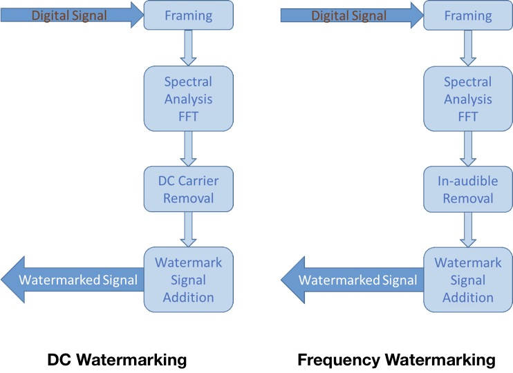
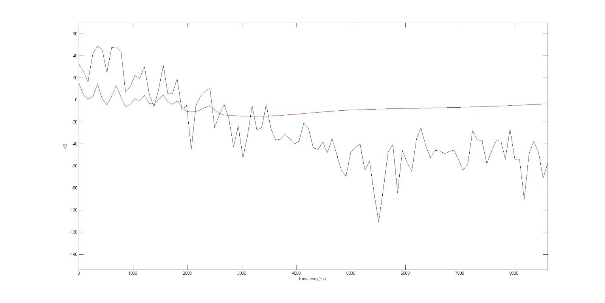
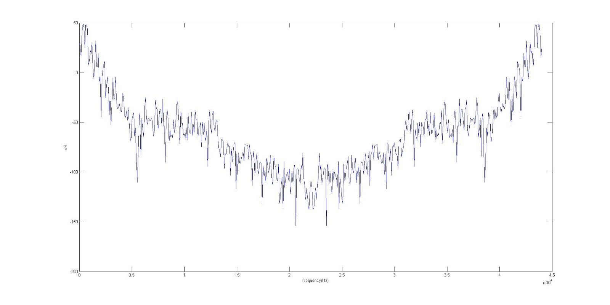
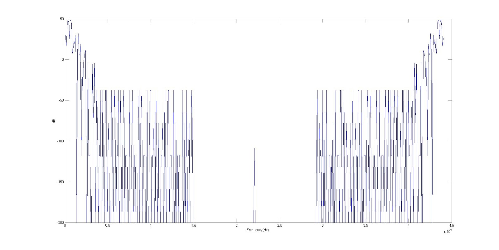

# Secret in Music
A Matlab project uses Signal Processing Technique — Digital Watermark to hide data in an audio track. 

## Introduction
**Digital Watermark** is a technique that embed specific information into digital signals like audio tracks, video films, or images. As to hiding information in music, it is called **Audio Watermarking**, using **Masking Effect** to make audience difficult to hear the information under the music. Moreover, there are two kinds of typical watermarking schemes: **DC Watermarking** and **Frequency Watermarking**, which one is based on **Temporal Masking** and while another is based on **Frequency Masking**. 

## Psychoacoustics - Masking Effects
A “weak” sound is difficult to be heard while a “strong” sound is also being played.

* Temporal Masking - Amplitude (Volume)
* Frequency Masking - Amplitude in Frequency

  

## DC Watermarking
DC Watermarking puts the information into the part of music, where the magnitude is lower than the perceptual threshold of human ears. 

## Frequency Watermarking
For Frequency Watermarking, since human ear has limit on distinguishing audio frequency, it is possible to find out a frequency band loud enough while the frequency near it are rather quiet. Therefore, we replace the frequency band with low magnitude to our information to make the watermark.

## Process
We implemented **Frequency Watermarking** in this project to achieve our goal.

The original soundtrack we used in this project is:
* Length: 30 seconds
* Sampling Rate: 44100 (1/s)
* Frame Length: 512 samples
* [Original Sound Track](https://drive.google.com/file/d/0B_MhQboJITZGRzJiYWYydlZDc2s/view)

The image that we put in:
* Size: 150*150 pixels 

Frame the audio track and do FFT, and find out the frequency threshold. 

  

 
The red line is the frequency threshold while the blue line is the original frequency. Replace the signal under threshold to the watermark signal.

**Original Frequency Spectrum** 

  

**Frequency Spectrum after In-audible Removal** 

  

## Result
[Watermarked Sound Track](https://drive.google.com/file/d/0B_MhQboJITZGZml2STNoMlVWRzQ/view)

Extracted Information (Image): 
 
Store more bits in one “slot” of frequency: 
  

The reconstructed image would inevitably follow with some noise due to the translation loss of doing FFT and IFFT. Moreover, the number of bit in frequency replacement will influence the result.

